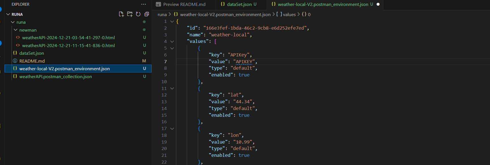

# Test Plan

## Project Overview
- **Project Name:** Current weather data
- **Version:** 2.5
- **Date:** 21/122024
- **Author:** July Bustamante
  
## Objective
The objective of this test plan is to outline the testing strategy, objectives, scope, and deliverables for the project.

## Scope
- **In-Scope:**
  - API response: JSON format API response
  - List of weather condition codes
  - API request by city name
  - and XML format
- **Out of Scope:**
  - Built-in geocoding
  - Built-in API request by city ID
  - Built-in API request by ZIP code
  - Format
  - Units of measurement
  - Multilingual support
  - Call back function for JavaScript code

## Test Strategy
- **Types of Testing:**
  - API testing

## Test Environment
- **Hardware Requirements:**
  - macOS 10.11 (El Capitan) and later, Windows 7 and later, and Linux Ubuntu 14.04 and late
- **Software Requirements:**
  - Chrome 80 and higher
  - Firefox 76 and higher
  - Edge 79 and higher
  - Safari 13.1.1 and higher
  
## Test Schedule
| Test Phase             | Start Date | End Date   | Responsible |
|------------------------|------------|------------|-------------|
| Test Planning          | 21/12/2024     | 21/2024     | July Bustamante      |
| Test Design            | 21/12/2024     | 21/2024     | July Bustamante      |
| Test Execution         |      21/12/2024     | 21/2024     | July Bustamante      |
| Test Closure           |21/12/2024     | 21/2024     | July Bustamante      |
## Test Cases
| Test Case ID | Description               | Expected Result     | Status  |
|--------------|---------------------------|----------------------|---------|
| TC001        | [Getting weather by geo cord]   | [200]   | [Pass/Fail] |
| TC002        | [Getting weather-wrong latitud]   | [400]   | [Pass/Fail] |
| TC003        | [Getting weather-wrong longitud]   | [400]   | [Pass/Fail] |
| TC004        | [Getting weather by city name]   | [200]   | [Pass/Fail] |
| TC005        | [Getting weather by wrong city name]   | [200]   | [Pass/Fail] |
| TC006        | [Getting weather by city name xml format]   | [200]   | [Pass/Fail] |

## Framework options
- **Postman:** A popular tool for testing APIs with a user-friendly interface; supports automated testing through Newman that is a CLI tool that is used to run the collections outside Postman, Ideal for CI/CD 
- **RestAssured:** A Java-based library designed for testing REST services; allows for easy integration with testing frameworks like JUnit or TestNG
- **Jest:** A JavaScript testing framework commonly used for testing APIs in Node.js applications.
- **SoapUI:**: Useful for both REST and SOAP APIs; it provides extensive testing capabilities including security and load testing.

## Framework Selection
The framework selected is Postman because it's easy to use, has a variety of features like [Postbot](https://blog.postman.com/introducing-postbot-postmans-new-ai-assistant/) a new AI assistant that helps o design better test cases for API calls, also Newman is a command-line tool that allows users to run test Postman collections for API testing.
The automation strategy is to use postman + newman + Jenkins because Postman is easy to use manually allowing you to keep it simple from the beginning but in the other hand, it gives you many modular options to automate as needed. Newman is very handy and fast tool. Jenkins is the very user-friendly and functional tool for CI/CD processes. The combination of these tools gives acceleration and increasing productivity in test automation.  
## Approval
- **Prepared By:** July Bustamante
- **Approved By:** Runa
- **Date of Approval:** 21/12/2024

-------------------------------------
## How to run

- Install the [“NodeJS”](https://nodejs.org/en/download/package-manager)
- Download newman

   > `npm install -g newman`
   
   > `npm install -g newman-reporter-htmlextra`

-Run collection with newmand and generate report

>`newman run weatherAPI.postman_collection.json --environment weather-local-v2.postman_environment.json --reporters cli,htmlextra
`

## Troubleshooting
- You'll need to sign up for a free API key and then copy it to the env varable

## loom video with explanation
https://www.loom.com/share/167291ec194347488288aba86916fa9a?sid=c070ac03-cb75-4484-8771-11a94db59d3a